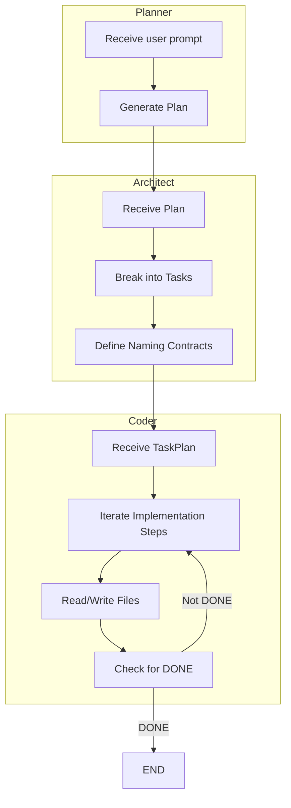

# App Builder Agents

This repository contains code and resources for building agent-based applications and utilities. It includes:

## Example Prompts

- Build a to-do list web app using HTML, CSS, and JavaScript.
- Generate a basic calculator application for the web with HTML, CSS, and JavaScript.

## File Structure

```text
App_Builder_Agents/
│   main.py
│
 ── agent/
    graph.py 
    prompts.py
    states.py
    tools.py
     __pycache__/

```


## Agents and Their Roles

- **Planner Agent**: Converts user prompts into a structured engineering plan (features, files, tech stack).
- **Architect Agent**: Breaks the plan into explicit implementation tasks, specifying file changes and function signatures.
- **Coder Agent**: Executes each implementation step, using tools to read/write files and ensure contract compliance.

## Real Flow Diagram of Nodes and Agents



